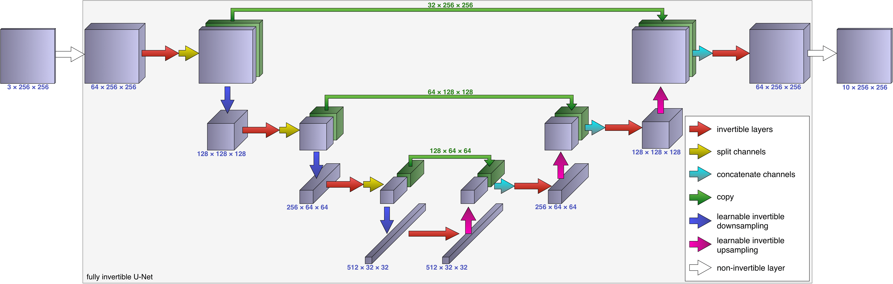

# iUNets - Fully invertible U-Nets in Pytorch
This library enables highly memory-efficient training of **fully-invertible 
U-Nets (iUNets)** in 1D, 2D and 3D for use cases such as segmentation of medical 
images. It is based on the paper 
[iUNets: Fully invertible U-Nets with Learnable Up- and Downsampling
](https://arxiv.org/abs/2005.05220) by Christian Etmann, Rihuan Ke &
Carola-Bibiane Schönlieb.

By combining well-known reversible layers (such as additive coupling layers)
with novel **learnable invertible up- and downsampling operators** and suitable
channel splitting/concatenation, the iUNet is fully bijective. This allows
for *reconstructing* activations instead of storing them.

*An iUNet used as a memory-efficient sub-network for segmenting a 3-channel
input into 10 classes.*

The following table exemplifies the memory savings that can be achieved
by applying our memory-efficient gradient calculation, in contrast to the
conventional backpropagation procedure. Details are found in the paper.

| Depth | Conventional |     Ours    | Ratio |
|-------|--------------|-------------|-------|
| 5     | 3.17 GB      | **0.85 GB** | 26.8% |
| 10    | 5.90 GB      | **1.09 GB** | 18.4% |
| 20    | 11.4 GB      | **1.57 GB** | 13.8% |
| 30    | 16.8 GB      | **2.06 GB** | 12.2% |

## Requirements
- Pytorch
- [MemCNN](https://github.com/silvandeleemput/memcnn)

## New features
Apart from a revamped API, compared to the previous version released early 2020, 
a lot of new features have been rolled out:
- Much better speed & numerical stability of the invertible learnable up- and 
downsampling due to more exact methods for parametrizing orthogonal matrices. 
    - The matrix exponential is now implemented via the scaling-and-squaring
      algorithm (which is exact up to machine precision).
    - The Cayley transform is implemented as an alternative method for 
      parametrizing orthogonal matrices.
- Learnable invertible up- and downsampling now supports different downsampling
 factors (i.e. strides) per dimension. This is handy especially in 3D, e.g. if 
 one wishes to look only at a few consecutive CT slices.
- The required padding for invertibility is now done automatically (if desired).
- The learnable invertible up- and downsampling now support different 
 initialization options (such as initialization as the Haar transform).
- Quality-of-life additions such as the `print_layout()` method.

## TODOs / Future Releases
This library will be continuously updated in the near future. It should now
have a *mostly* stabled API, but expect some minor changes in the future.

Major updates to come:
- A full API documentation (generated by `Sphinx`) is in the works.
- Working examples will be added.
- More customization options.
- Channel mixing with orthogonal 1x1 convolutions.

# Example usage
### A simple 2D iUNet
A version of the iUNet depicted above can be created incredibly simply. Let's
say that we want 2 additive coupling layers per resolution, both in the
downsampling branch (left) and the upsampling branch (right).

    from iunets import iUNet
    model = iUNet(
        in_channels=64,
        architecture=[2,2,2,2],
        dim=2
    )
    model.print_layout()
    
*Output:*

    64-64-(32/32)---------------------------------------------------------(32/32)-64-64
    ---------128-128-(64/64)----------------------------------(64/64)-128-128----------
    ---------------------256-256-(128/128)-------(128/128)-256-256---------------------
    ---------------------------------512-512--512-512----------------------------------

This model can now be integrated into the normal Pytorch workflow (and in 
particular be used as a sub-network) just like any other `torch.nn.Module`,
and it automatically employs the memory-efficient backpropagation.

### A fully-customized 3D iUNet
While the above example shows that a simple iUNet can be created quite simply,
our library also allows for a high degree of customization. Refer to the API
documentation for more information.

    from iunets import iUNet
    from iunets.layers import create_standard_module
    model = iUNet(
        in_channels=7,
        dim=3,
        architecture=[2,3,1,3], 
        create_module_fn=create_standard_module, 
        module_kwargs={'block_depth': 3},
        slice_mode='double',
        resampling_stride=2,
        learnable_resampling=True,
        resampling_init='haar',
        resampling_method='cayley',
        disable_custom_gradient=False, 
        revert_input_padding=True,
        padding_mode='reflect',
        verbose=1
        )
    model.print_layout()

*Output:*

    7-7-(5/2)-------------------------------------------------(5/2)-7-7
    ------16-16-16-(12/4)------------------------(12/4)-16-16-16-------
    ------------------32-(24/8)------------(24/8)-32-------------------
    ------------------------64-64-64--64-64-64-------------------------

### Different downsampling strides
Very often, medical imaging data is not exactly cube-shaped. This can for 
example be the case when only a few consecutive slices in z-direction of a CT 
image are considered. In these cases, it makes sense to apply fewer (or less
extreme) downsampling operators to these smaller axes. With the keyword
`resampling_stride`, the (up- and) downsampling strides can be controlled
exactly.
The format can be either a single integer, a single tuple (where the
length corresponds to the spatial dimensions of the data), or a list
containing either of the last two options (where the length of the
list has to be equal to the number of downsampling operations),
e.g. `2`, `(2,1,3)`, `[(2,1,3), (2,2,2), (4,3,1)]`.

### Padding behavior
For full invertibility of any invertible network, the total dimensionality of 
the output has to be the same as the dimensionality of the input. This can be
problematic when invertible downsampling operations are involved. Take the 
example of an image with odd-valued resolution -- this cannot be downsampled
exactly by a factor of 2 without remainder! Our library automatically chooses
the padding required to guarantee invertibility from padded input to output.

    import torch
    from torch.nn.functional import pad
    from iunets import iUNet
    model = iUNet(
        in_channels=32,
        architecture=[2,2,2,2],
        dim=2,
        resampling_stride=[2,3,3],
        revert_input_padding=False,
        verbose=0,
    )
    x = torch.randn(2, 32, 128, 88)
    y = model(x)

    
    print("Input batch shape: {}".format(tuple(x.shape)))
    print("resampling_stride={} results in total downsampling factors per "
        "spatial dimension of {}".format(
            model.resampling_stride, model.downsampling_factors
        ))
    print("Trying to pad to resolution {}...".format(model.get_padding(x)[0]))
    print("Padded output shape: {}".format(tuple(y.shape)))
    
    print("Setting revert_input_padding to False (standard behavior)...")
    model.revert_input_padding = True
    y = model(x)
    print("Now cropped output shape: {}".format(tuple(y.shape)))
    
*Output:*

    Input batch shape: (2, 32, 128, 88)
    resampling_stride=[(2, 2), (3, 3), (3, 3)] results in total downsampling factors per spatial dimension of (18, 18)
    Trying to pad to resolution [144, 90]...
    Padded output shape: (2, 32, 144, 90)
    Setting revert_input_padding to False (standard behavior)...
    Now cropped output shape: (2, 32, 128, 88)

This functionality uses the `torch.nn.functional.pad` API. For further control,
the user can set its `padding_mode` and `padding_value` parameters.
