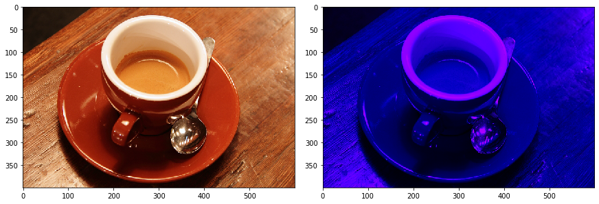

=====================================
Tutorial 4: Invertible Channel Mixing
=====================================

Additive coupling layers (as implemented here) switch the roles of the two
groups of input channels :math:`x_1` and :math:`x_2` at the end of computation.
This way, "it's each channel's turn to be convolved" at some point. If we didn't
do that, the computational block :math:`F` would operate on the same channels
throughout the network.

A generalization of this "switching of channel groups" is to apply a general
permutation of the :math:`n` channels at the end. While it's impossible to
smoothly parametrize permutations (which makes training these by gradient
descent an impossibility), we can parametrize something more general (or to be
precise: a generalization of a subset of the set of permutations): the set of
special orthogonal :math:`(n \times n)`-matrices. The parametrization is
essentially the same as in the case of invertible up- and downsampling.

These matrices can then be used for orthogonally combining the input channels,
which (due to orthogonality) is an invertible computation.

A simple example
----------------

In the following, we demonstrate invertible channel mixing

.. code:: python

    import numpy as np
    from skimage import data
    from matplotlib import pyplot as plt

    import torch
    from iunets.layers import InvertibleChannelMixing2D

    # Load example image
    img = np.array(data.coffee(), dtype=np.float32) / 255.

    # Helper functions to transfer between Numpy and Pytorch
    to_torch_rgb = lambda img: torch.Tensor(np.expand_dims(np.transpose(img,(2,0,1)), 0))
    to_numpy_rgb = lambda img: np.transpose(img.detach().numpy(), (0,2,3,1))

    # Transfer to Torch, reshape to batch of shape (1, 1, 512, 512)
    torch_img = to_torch_rgb(img)

    # Create learnable invertible downsampling layer
    channel_mixing = InvertibleChannelMixing2D(
        in_channels=3
    )

    # Create random weights
    channel_mixing.weight.data = torch.randn(3, 3)

    mixed = channel_mixing(torch_img)
    mixed_np = to_numpy_rgb(mixed)

    fig = plt.figure(figsize=(12,7),constrained_layout=True)
    ax_array = fig.subplots(1, 2, squeeze=False)
    ax_array[0, 0].imshow(img)
    ax_array[0, 1].imshow(mixed_np[0])

    img_reconstruction = channel_mixing.inverse(mixed)
    print("MSE: {}".format(
        torch.nn.functional.mse_loss(torch_img, img_reconstruction).item())
    )

Output:

.. code:: text

    MSE: 6.993812132075408e-15

    The example image before and after applying invertible channel mixing.

Invertible channel mixing in iUNets
-----------------------------------

Invertible channel mixing can be controlled inside of the iUNet by the following
keywords:

    * ``channel_mixing_freq``, which controls how often a channel mixing layer is applied. E.g.

        * The default value ``channel_mixing_freq=-1`` only applies an invertible channel mixing *before channel splitting* and *after channel re-concatenation*. Default mode.

        * E.g. ``channel_mixing_freq=2`` applies an invertible channel mixing layer after every second additive coupling layer.

        * ``channel_mixing_freq=0`` does not apply invertible channel mixing.

    * ``channel_mixing_method``, which controls the parametrization method for (special) orthogonal matrices. Current options:

        * ``"cayley"``: Cayley transform of a skew-symmetric matrix

        * ``"exp"``: matrix exponential of a skew-symmetric matrix

        * ``"householder"``: a product of Householder matrices

    * ``channel_mixing_kwargs``, which can be used to provide additional keywords.

        * Currently only used if Householder transforms are used for parametrization, in which case ``"n_reflections"`` controls the number of Householder reflections (defaults to using all possible reflections).
