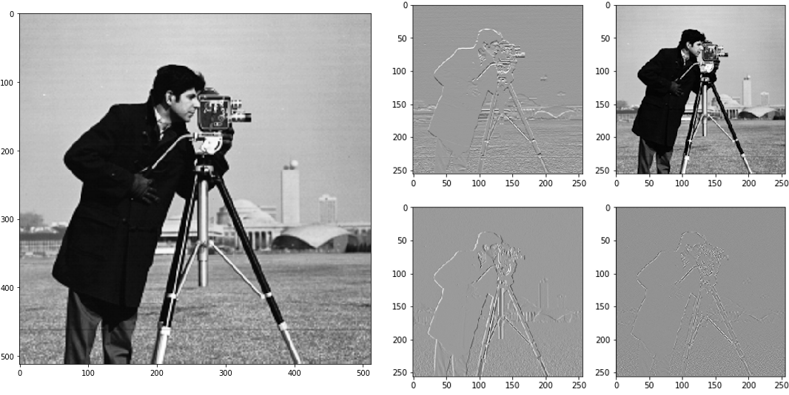

=====================================================
Tutorial 3: Invertible Learnable Up- and Downsampling
=====================================================

One of the central aspects of U-Nets are up- and downsampling operations: In the
encoder portion, the features are iteratively downsampled, before they are
recombined with their later upsampled counterparts by channel concatenation in
the decoder portion. At first, building invertible up- or downsampling layers
seems nonsensical, as the resolution (and thus the dimensionality) of the input
is altered.

However, if -- in the case of downsampling -- the number of channels is
increased to make up for the loss of resolution, such that the total number of
pixels/voxels remains constant after downsampling, the downsampling can be made
invertible.

The following Theorem describes the concept of invertible downsampling for
2D data. The theorem is given in a more formal way (and for general
:math:`d`-dimensional data) in our paper.

**Theorem** (invertible downsampling for 2D data, informal, Pytorch
nomenclature): Let :math:`s_1, s_2 \in \mathbb{N}` and :math:`\sigma = s_1 s_2`,
and let :math:`M` be an orthogonal :math:`(\sigma \times \sigma)`-matrix. Let
:math:`x` be our input batch of shape :math:`(N, 1, H, W)`, where :math:`H` is
divisible by :math:`s_1` and :math:`W` is divisible by :math:`s_2` (without
remainders). We now reorder the entries of :math:`M` into a convolutional kernel
:math:`K` of shape :math:`(\sigma, 1, s_1, s_2)` in a specific way. Then the
convolution of :math:`x` with the kernel :math:`K` using a stride of
:math:`(s_1,s_2)` produces an output :math:`y` of shape
:math:`(N, \sigma, H/s_1, W/s_2)`. This operation can be inverted by applying
the associated transpose convolution with kernel :math:`K` to :math:`y`.

This concept can be easily extended to general input batches with :math:`C`
channels by applying this to each input channel independently. The inverse
operation to invertible downsampling (via a transposed strided
convolution) realizes *invertible upsampling*.

An introductory example
-----------------------

The following example requires the package ``skimage`` to load the example
image.

.. code:: python

    import numpy as np
    from skimage import data
    from matplotlib import pyplot as plt

    import torch
    from iunets.layers import InvertibleDownsampling2D

    # Load example image
    img = np.array(data.camera(), dtype=np.float32) / 255.

    # Display input image
    plt.figure(figsize=(7,7),constrained_layout=True)
    plt.imshow(img, cmap='Greys_r')

    # Helper functions to transfer between Numpy and Pytorch
    to_torch = lambda img: torch.Tensor(np.expand_dims(img, (0,1)))
    to_numpy = lambda img: img.detach().numpy()

    # Transfer to Torch, reshape to batch of shape (1, 1, 512, 512)
    torch_img = to_torch(img)

    # Create learnable invertible downsampling layer
    downsampling = InvertibleDownsampling2D(
        in_channels=1,
        stride=(2,2)
    )

    # Compute downsampled images
    output = downsampling(torch_img)
    output = to_numpy(output)

    # Display output images
    fig = plt.figure(figsize=(7,7),constrained_layout=True)
    ax_array = fig.subplots(2, 2, squeeze=False)
    ax_array[0, 0].imshow(output[0,0], cmap='Greys_r')
    ax_array[0, 1].imshow(output[0,1], cmap='Greys_r')
    ax_array[1, 0].imshow(output[0,2], cmap='Greys_r')
    ax_array[1, 1].imshow(output[0,3], cmap='Greys_r')

    The example image after invertibly downsampling with a stride of (2,2).
    By default, this is initialized as the Haar transform.

We now check how well the inversion works:

.. code:: python

    img_reconstruction = downsampling.inverse(downsampled)
    print("MSE: {}".format(torch.nn.functional.mse_loss(torch_img, img_reconstruction).item()))

Output:

.. code-block:: text

    MSE: 1.0410113272302972e-15

Invertible up- and downsampling in iUNets
-----------------------------------------
The behavior of the invertible up- and downsampling operations can be
controlled in the iUNet constructor.

.. code:: python

    from iunets import iUNet
    model = iUNet(
        channels=(32,64,128,256),
        dim=3,
        architecture=(2,2,2,2),
        resampling_stride=2,
        resampling_method='exp',
        resampling_init='haar',
        resampling_kwargs={}
    )
    model.print_layout()

Output:

.. code-block:: text

    32-32-(24/8)----------------------------------------------------(24/8)-32-32
    ---------64-64-(48/16)--------------------------------(48/16)-64-64---------
    ------------------128-128-(96/32)---------(96/32)-128-128-------------------
    ------------------------------256-256--256-256------------------------------

The relevant keywords are:

    * ``resampling_stride``, which controls the amount of spatial down-/upsampling and hence the channel multiplier. In the following section, further details are given.

    * ``resampling_method``, which controls the parametrization method for (special) orthogonal matrices. Current options are ``"exp"``, ``"cayley"`` and ``"householder"``.

        * ``"cayley"``: Cayley transform of a skew-symmetric matrix

        * ``"exp"``: matrix exponential of a skew-symmetric matrix

        * ``"householder"``: a product of Householder matrices

    * ``resampling_init``, which controls the initialization. Current options are ``"haar"``, ``"squeeze"``, ``"random"`` or a user-specified ``torch.Tensor`` or ``numpy.ndarray``.

    * ``resampling_kwargs``, which can be used to provide additional keywords. Currently only used if Householder transforms are used for parametrization, in which case ``"n_reflections"`` controls the number of Householder reflections (defaults to using all possible reflections).

        * Currently only used if Householder transforms are used for parametrization, in which case ``"n_reflections"`` controls the number of Householder reflections (defaults to using all possible reflections).

Anisotropic up- and downsampling
--------------------------------

Very often, medical imaging data is not exactly cube-shaped. This can for
example be the case when only a few consecutive slices in z-direction of a CT
image are considered. In these cases, it makes sense to apply fewer (or less
extreme) downsampling operators to these smaller axes. With the keyword
``resampling_stride``, the (up- and) downsampling strides can be controlled
exactly, in order to achieve the desired anisotropic downsampling.
The format can be either a single integer, a single tuple (where the
length corresponds to the spatial dimensions of the data), or a list
containing either of the last two options (where the length of the
list has to be equal to the number of downsampling operations), e.g.

* ``resampling_stride=2`` will result in a downsampling factor of ``2`` in each coordinate, for each up- and downsampling operation.

* ``resampling_stride=(2,1,3)`` will result in downsampling factors ``(2,1,3)`` along Pytorch's ``(z,y,x)``-coordinate system for each up- and downsampling operation.

* ``resampling_stride=[(2,1,3), 2, (4,3,1)]`` will use

    * factors ``(2,1,3)`` in the first downsampling operation

    * factor ``2`` along each coordinate in the second downsampling operation

    * factors ``(4,3,1)`` in the third downsampling operation

    * This also applies to the respective upsampling operations in the decoding portion of the iUNet.

    * Note that this (resolution-specific) setting requires ``len(architecture)==4``.

Channel multipliers and slicing behavior
----------------------------------------

The change in the number of channels when performing invertible up- or
downsampling is inherently tied to the up-/downsampling factors, i.e. the
``resampling_stride``. The factor by which the number of channels is multiplied
respectively divided is called the *channel multiplier* (:math:`\sigma` in the
above introduction).

For example in 3D, a downsampling stride of 2 in all directions (i.e.
``resampling_stride=2``) results in a channel multiplier of 8. However, the
number of channels does not increase by this factor of 8 with each decreasing
resolution level: This is because invertibly downsampling a pre-specified number
of channels gets sliced off (for later re-concatenation in the decoding portion
of the iUNet). The number of sliced-off channels thus determines the factor
by which the number of channels changes in each resolution level.

This means that not any specific setting for ``channels`` can be enforced.
However, the most

Example:

.. code:: python

    model = iUNet(
        channels=(3,25,32,55,128),
        dim=3,
        architecture=(2,2,2,2,2),
        resampling_stride=[(1,2,3),(2,2,2),(5,1,2),2]
    )
    model.print_layout()

    print("Channel multipliers: {}".format(model.channel_multipliers))
    print("Downsampling factors: {}".format(model.downsampling_factors))

Output:

.. code:: text

    Could not exactly create an iUNet with channels=(3, 25, 32, 55, 128)
    and resampling_stride=[(1, 2, 3), (2, 2, 2), (5, 1, 2), (2, 2, 2)].
    Instead using closest achievable configuration: channels=(3, 12, 32, 60, 128).
    Average relative error: 0.1527

    3-3-(1/2)-----------------------------------------------------------------(1/2)-3-3
    ------12-12-(8/4)------------------------------------------------(8/4)-12-12-------
    ---------------32-32-(26/6)-----------------------------(26/6)-32-32---------------
    ------------------------60-60-(44/16)---------(44/16)-60-60------------------------
    ---------------------------------128-128--128-128----------------------------------

    Channel multipliers: [6, 8, 10, 8]
    Downsampling factors: (20, 8, 24)

Here, the `channel multipliers` are the products of the resampling factors over
all spatial dimensions (e.g. ``1*2*3=6`` for the first downsampling operation),
whereas the `downsampling factors` denote, by how much the input data is
downsampled in total (e.g. ``1*2*5*2=20`` for the first coordinate).
