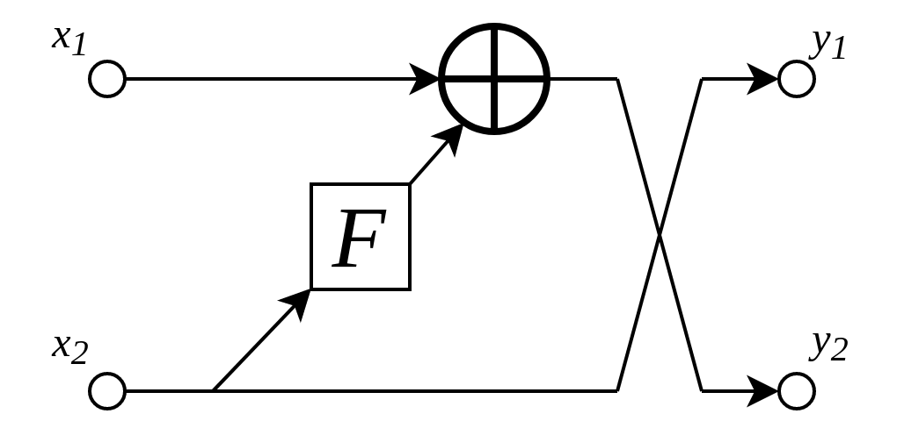
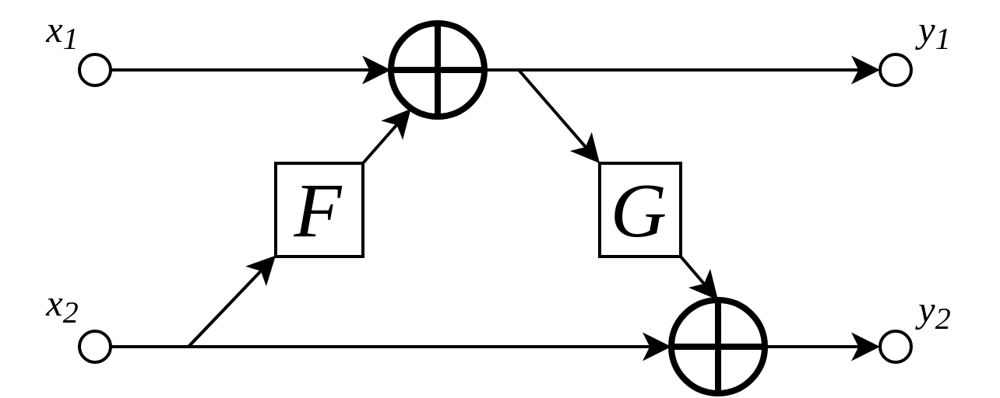

===================================================
Tutorial 2: Invertible Resolution-Preserving Layers
===================================================

Additive coupling layers
------------------------

Additive coupling layers are simple invertible layers, which are fundamental
building blocks of iUNets -- although other types of layers can also easily be
implemented by the user. They are conceptually similar to residual layers,
and their inverse mapping can be computed just as fast as their forward mapping.
In contrast to invertible learnable up- and downsampling, these preserve the
resolution of their input. They are therefore used for computing features
within each specific resolution of the iUNet.

    Additive coupling layers as implemented in this library. The input and
    output is split into two groups of channels. Here, the computational
    block :math:`F` can be any sequence of e.g. convolutional layers with
    normalization. Note that the roles of :math:`x_1` and :math:`x_2` are
    reversed afterwards.

By splitting the input activation :math:`x` and output activation :math:`y`
into two groups of channels (i.e. :math:`(x_1, x_2) \cong x` and
:math:`(y_1, y_2) \cong y`), additive coupling layers define an invertible
mapping :math:`x \mapsto y` via

.. math::

   y_1 &= x_2

   y_2 &= x_1 + F(x_2),

where the `coupling function` :math:`F` is an (almost) arbitrary mapping.
:math:`F` just has to map from the space of :math:`x_2` to the space of
:math:`x_1`. In practice, this can for instance be a sequence of
convolutional layers with batch normalization.

By default, this is one convolutional layer followed by a
leaky ReLU nonlinearity and layer optimization, although the number of layers
can be easily specified, as explained below.

The inverse of the above mapping is computed algebraically via

.. math::

   x_1 &= y_2 - F(y_1)

   x_2 &= y_1.

How many additive coupling layers?
----------------------------------

Most users will first try to transfer their experience from non-invertible
networks to additive coupling layers. The most comparable type of layer to
additive coupling layers are probably residual layers, as they add a learnable
transformation of the input to the original input. One can *very roughly*
think of two additive coupling layers as being equivalent to one residual
layer (strongly depending of course on the exact design of :math:`F`).

    Two consecutive additive coupling layers operate on all input channels,
    whereas a single additive coupling layer only operates on one portion
    of the input channels.

Note that these 'double' additive coupling layers are also sometimes referred
to as additive coupling layers. In this implementation, we decided to use the
'single' additive coupling strategy, as one essentially halves the required
memory this way.

Customization options
---------------------

A custom resolution-preserving invertible layer can be specified by supplying
a specific function to the iUNet via the ``create_module_fn`` keyword. This
function has to have the signature

.. code:: python

    create_module_fn(in_channels, **kwargs)

and has to return an instance of ``torch.nn.Module`` which, additionally to
its ``forward``-method, has to implement an ``inverse``-method. When calling the
``iUNet`` constructor, each resolution-preserving invertible layer is then
created by a call to ``create_module_fn``. The dafault value for
``create_module_fn`` is ``iunets.layers.create_standard_module``.

This can be for instance an additive coupling layer with a desired mapping
``F``, e.g.

.. code:: python

    import torch
    from torch import nn
    import iunets
    from iunets.layers import AdditiveCoupling

    # Define a custom additive coupling layer
    def my_module_fn(in_channels, **kwargs):
        channel_split_pos = in_channels//2

        conv_layer = nn.Conv3d(in_channels = channel_split_pos,
                               out_channels = in_channels - channel_split_pos,
                               kernel_size = 3,
                               padding = 1)
        nonlinearity = nn.ReLU()
        F = nn.Sequential(conv_layer, nonlinearity)

        return AdditiveCoupling(F, channel_split_pos)

    # Create a batch of random data
    x = torch.randn(4, 32, 128, 128, 128).to('cuda')

    # Create an instance of the above invertible layer
    invertible_layer = my_module_fn(32).to('cuda')

    # Compute the output of the layer and reconstruct its input
    y = invertible_layer(x)
    x_reconstructed = invertible_layer.inverse(y)

    # Check the quality of reconstruction
    print("MSE: {}".format(nn.functional.mse_loss(x, x_reconstructed).item()))

Output:

.. code-block:: text

    MSE: 2.5294868141494326e-16

Now we can plug the above-defined ``my_module_fn`` into an iUNet:

.. code:: python

    # Create a iUNet with create_module_fn = my_module_fn
    model = iunets.iUNet(
        channels = (32,64,128),
        dim = 3,
        architecture = (2,3,4),
        create_module_fn = my_module_fn
    )
    model = model.to('cuda')

    # Compute the output of the iUNet and reconstruct its input
    y = model(x)
    x_reconstructed = model.inverse(y)

    # Check the quality of reconstruction
    print("MSE: {}".format(nn.functional.mse_loss(x, x_reconstructed).item()))

Output:

.. code-block:: text

    MSE: 3.4675983872495264e-13

Additional options
------------------

By supplying a dictionary to the iUNet via ``module_kwargs``, its values
can be consumed by ``create_module_fn``. In the following example, the layer's
nonlinearity can be specified via a string.

.. code:: python

    def my_customizable_module_fn(in_channels, **kwargs):
        channel_split_pos = in_channels//2
        conv_layer = nn.Conv3d(in_channels = channel_split_pos,
                               out_channels = in_channels - channel_split_pos,
                               kernel_size = 3,
                               padding = 1)
        nonlinearity_str = kwargs.get('nonlinearity', 'ReLU')
        nonlinearity = getattr(nn, nonlinearity_str)()
        F = nn.Sequential(conv_layer, nonlinearity)
        return AdditiveCoupling(F, channel_split_pos)

    model = iunets.iUNet(
        channels=(32,64,128),
        dim = 3,
        architecture = (2,3,4),
        create_module_fn = my_customizable_module_fn,
        module_kwargs = {'nonlinearity': 'LeakyReLU'}
    )
    model = model.to('cuda')

For the default module creator ``iunets.layers.create_standard_module``,
passable keywords are ``"block_depth"`` (which controls the number of
Conv-LReLU-Normalization-blocks, expecting an ``int``) and ``zero_init``
(which initializes these blocks as zeros, expecting a ``bool``; this initializes
the whole additive coupling layer as the identity, up to the reordering of
channels).

Layerwise definition of invertible layers
-----------------------------------------

When ``create_module_fn`` is called from inside the iUNet constructor, apart
from optional keywords, ``kwargs`` also automatically includes basic
information about the iUNet (``dim`` and ``architecture``), as well as the
coordinates of the current module. These are:

    * ``"branch"``, which denotes the encoder (``"encoder"``, the downsampling branch) or the decoder (``"decoder"``, the upsampling branch) of the iUNet
    * ``"level"``, which denotes the index of the resolution level inside the iUNet, where ``0`` denotes the highest resolution
    * ``"module_index"``, which runs from ``0`` to ``architecture[level]-1``.

This allows for fine-grained control of the creation of the layers. The
following function exemplifies this. In the above examples, we had to choose
a 3D convolution operator, whereas we would have to create a completely
different function if we were to apply this to 2D data. Here, we choose the
correct convolution operator based on the value of ``dim``. Furthermore, we add
an instance normalization layer in the very last block of the iUNet.

.. code:: python

    import numpy as np

    def my_fine_grained_module_fn(in_channels, **kwargs):
        channel_split_pos = in_channels//2

        # Coordinates of the current module
        branch = kwargs.get('branch')
        level = kwargs.get('level')
        module_index = kwargs.get('module_index')

        # architecure keyword passed to the iUNet
        architecture = kwargs.get('architecture')

        # Dimensionality of the data, for choosing the right convolution
        dim = kwargs.get('dim')

        conv_op = [nn.Conv1d, nn.Conv2d, nn.Conv3d][dim-1]
        conv_layer = conv_op(in_channels = channel_split_pos,
                             out_channels = in_channels - channel_split_pos,
                             kernel_size = 3,
                             padding = 1)

        nonlinearity = nn.ReLU()
        layers = [conv_layer, nonlinearity]

        # In the very last layer, apply an instance normalization
        if (branch is 'decoder' and
            level==0 and
            module_index==architecture[0]-1):
            print(
                "Adding instance normalization in coordinate ({},{},{}).".format(
                    branch, level, module_index
                )
            )

            norm_op = [nn.InstanceNorm1d, nn.InstanceNorm2d, nn.InstanceNorm3d][dim-1]
            layers.append(norm_op(channel_split_pos))

        F = nn.Sequential(*layers)
        return AdditiveCoupling(F, channel_split_pos)

    model = iunets.iUNet(
        channels=(32,64,128),
        dim = 3,
        architecture = [3,4,5],
        create_module_fn = my_fine_grained_module_fn
    )
    model = model.to('cuda')

Output:

.. code-block:: text

    Adding instance normalization in coordinate (decoder,0,2).
